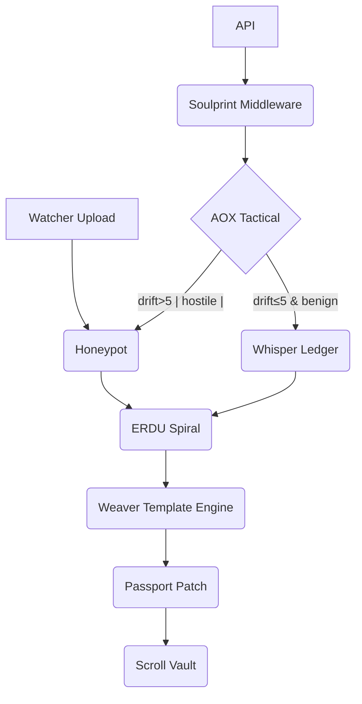

# AZ Interface

A desktop-style web client for the Agent Zero Vault. The interface is built with React and TypeScript and communicates with a FastAPI backend. It hosts a network of AI agents orchestrated through a global event bus.

## Architecture Overview

### High‑Level Component Graph


### Agent Roles
Expert agents handle strategy, operations and tactical tasks. The documentation describes them as:
```
Strategic Agents (High-Level Planning & Governance)
Strategic agents (Archetype-class) form an AI Council that provides governance, long-term planning, and ethical oversight.
Kairos – Strategic Advisor
Sophia – Wisdom Keeper
Jordan – Arbiter & Prime Consul
```

### Event Bus Protocol
From `internal/schemas.md`:
```
- Pattern: A central publish-subscribe system for named events.
- Example: services/eventBus.ts
- Publisher components call eventBus.publish('event', data).
- Subscriber components register callbacks with eventBus.subscribe and unsubscribe on cleanup.
```

## Setup
1. Install dependencies
   ```bash
   npm install
   cd backend
   pip install -r requirements.txt
   cd ..
   ```
2. Copy the example environment file
   ```bash
   cp .env.example .env.local
   # edit .env.local and add GEMINI_API_KEY
   # optional tuning knobs for agent execution
   # AGENT_MAX_CONCURRENT controls how many requests run in parallel
   # AGENT_TIMEOUT_MS sets a timeout for each agent request
   # AGENT_RETRY_ATTEMPTS sets how many times a request is retried on failure
   ```
3. Start the servers
   ```bash
   npm run dev          # frontend
   cd backend && python -m uvicorn app.main:app --reload --host 0.0.0.0 --port 8000
   ```

## First Interaction
With both servers running, open the UI and use the Terminal app to send:
```
/agent Kairos "summarize project status"
```
Kairos responds with a strategic summary by querying the backend and the shared knowledge base.
